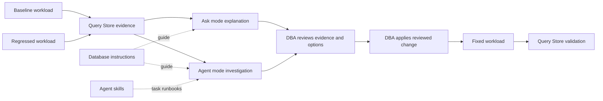

# SQL Server + GitHub Copilot: AI-Assisted DBA Workflow

A hands-on learning repository for Database Administrators using **GitHub Copilot
in SQL Server Management Studio (SSMS)**. It shows how to investigate a measured
performance regression, customize Copilot with database instructions and Agent
skills, review recommendations, and validate the result without transferring
ownership of the decision.

> The default path assumes you already have a nonproduction SQL Server. If you
> need a disposable environment, use the
> [optional Azure lab guide](infra/README.md). Azure is a convenience for the
> exercise, not a requirement for GitHub Copilot in SSMS.

The operating model is simple:

> **Query Store supplies evidence -> Copilot organizes the investigation -> the
> DBA decides and applies a reviewed change -> Query Store validates the result.**

## Start here

Choose the path that matches your environment:

| Starting point | What to do |
| --- | --- |
| Existing nonproduction SQL Server | Install or update SSMS, clone this repository onto the SSMS machine, restore WideWorldImporters, and continue with [Get GitHub Copilot working in SSMS](#get-github-copilot-working-in-ssms). |
| No suitable SQL Server | Follow the [optional Azure lab guide](infra/README.md), then return to the same SSMS learning flow. |
| Demo database already prepared | Keep the [one-page prompt sheet](copilot/ssms-demo-prompts.md) open and begin with [Learn Ask mode](#learn-ask-mode). |
| Adopting customizations for a team | Start with [Customize and extend Copilot](#customize-and-extend-copilot) and the [skills and agents catalog](.github/README.md). |

The repository folder must be available on the machine running SSMS. For example:

```powershell
git clone https://github.com/aidalgo/sql-ai-dba-copilot-demo.git
cd sql-ai-dba-copilot-demo
```

## What you will learn

- Use **Ask mode** to explain T-SQL, identify a non-sargable predicate, and draft
  a safer rewrite.
- Use **Agent mode** for a multi-step, read-only Query Store investigation with
  explicit approval checkpoints.
- Add database-wide and object-specific context through `CONSTITUTION.md` and
  `AGENTS.md` extended properties.
- Package repeatable DBA procedures as **Agent skills** that SSMS discovers and
  activates by intent.
- Extend Agent mode with **MCP tools** when an external workflow is appropriate.
- Understand where **VS Code custom agents** fit, without implying that SSMS loads
  `*.agent.md` files.
- Keep SQL Server permissions, human review, validation, and rollback as the real
  operating controls.

## Workflow and control model



| Responsibility | Repository mechanism | Meaning |
| --- | --- | --- |
| Evidence | Query Store plans, runtime metrics, and workload windows | Source of truth for the measured comparison |
| Interpretation | Ask mode and Agent mode | Explains evidence, gathers context, and structures options |
| Guidance | Database instructions and Agent skills | Team-owned context and runbooks shape behavior but grant no authority |
| Intent checkpoint | Agent mode approvals | The operator reviews a proposed action before execution |
| Enforcement | SQL Server permissions | The connected or configured execution identity determines what is authorized |
| Ownership | DBA change process | The DBA owns the decision, test, rollback, and validation |

Copilot is part of the investigation path. It is not a replacement control plane
for SQL Server.

## Scope

- Run the exercise in an isolated, nonproduction environment with sample data.
- The workflow demonstrates relative before/after evidence, not a hardware
  benchmark.
- Agent mode is kept read-only during investigation. The DBA applies the selected
  fix manually.
- The supplied Query Store settings favor a fast demo and should not be copied to
  production without review.
- The optional Azure deployment is intentionally simple and is not a production
  architecture.

## Prerequisites

For the complete Ask mode, Agent mode, and Agent skills path:

- **SSMS 22.7 or later** with the **AI Assistance** workload. Agent mode is
  currently in preview.
- A GitHub account with Copilot access. **Copilot Free is supported** in SSMS.
- Outbound GitHub Copilot connectivity from the machine running SSMS. The SQL
  Server itself does not need outbound Copilot connectivity.
- The repository on the machine running SSMS so the SQL files and workspace
  skills are available.

Choose one database environment before preparing the exercise:

| Environment | Prerequisite path |
| --- | --- |
| Existing environment | Use a nonproduction SQL Server 2019 or 2022 instance where you can restore WideWorldImporters, enable Query Store, and create objects in a `Demo` schema. |
| Azure lab | If you do not have a suitable instance, follow the [optional Azure lab guide](infra/README.md) to deploy a disposable jumpbox and private SQL Server 2022 VM, then return to [Get GitHub Copilot working in SSMS](#get-github-copilot-working-in-ssms). |

The Azure lab is optional and exists only to provide the prerequisites for this
exercise. You do not need to deploy it when an appropriate SQL Server is already
available.

A corporate GitHub account works when organizational policy permits sign-in from
the SSMS machine. If Conditional Access requires a managed device, use an
approved managed workstation or an account permitted for the isolated lab. That
restriction belongs to the organization's identity policy, not to Copilot in
SSMS generally.

## Get GitHub Copilot working in SSMS

1. Install SSMS 22.7 or later from <https://aka.ms/ssms>.
2. In the Visual Studio Installer, modify the SSMS installation and select the
   **AI Assistance** workload.
3. Open SSMS and connect a query editor to a nonproduction database.
4. Select the GitHub Copilot badge in the upper-right corner, open Chat, and sign
   in. If needed, select **Sign up for Copilot Free**.
5. Keep the mode selector on **Ask** and try a first prompt with a query selected:

   ```text
   Explain this query in DBA terms. Identify any correctness or performance risks, but do not change anything.
   ```

6. Confirm the response uses the active database context. If Copilot reports that
   the connection context is unsupported, make a query window for the target
   database active and check the database dropdown above the editor.

This first interaction does not require the supplied Azure environment or demo
workload. Continue below for the deterministic Query Store exercise.

## Prepare the WideWorldImporters exercise

Use an existing nonproduction instance or finish the
[optional Azure lab](infra/README.md). Restore Microsoft's
[WideWorldImporters sample backup](https://github.com/Microsoft/sql-server-samples/releases/download/wide-world-importers-v1.0/WideWorldImporters-Full.bak)
through your normal restore process, then run the following files in order from a
query window connected to **WideWorldImporters**.

| Order | Script | Purpose |
| --- | --- | --- |
| 00 | [00-verify-wideworldimporters.sql](scripts/sql/00-verify-wideworldimporters.sql) | Verify the database and source tables. |
| 01 | [01-enable-query-store.sql](scripts/sql/01-enable-query-store.sql) | Enable Query Store with fast, demo-only capture settings. |
| 02 | [02-create-demo-schema.sql](scripts/sql/02-create-demo-schema.sql) | Create `Demo.LargeInvoiceFact` and `Demo.WorkloadLog`. |
| 02b | [02b-amplify-demo-data.sql](scripts/sql/02b-amplify-demo-data.sql) | **Required:** populate the fact table, targeting about 10 million rows by default. |
| 03 | [03-create-demo-procedures.sql](scripts/sql/03-create-demo-procedures.sql) | Create baseline, regressed, and fixed variants for two logical query families. |
| 04 | [04-create-baseline-indexes.sql](scripts/sql/04-create-baseline-indexes.sql) | Create supporting indexes and refresh statistics. |
| 15 | [15-install-copilot-constitution.sql](scripts/sql/15-install-copilot-constitution.sql) | Install database instructions and the illustrative low-privilege user. |

Script `02b` is the population step, not an optional mode. Adjust `@TargetRows`
near the top of the file when capacity is limited; the default produces the
clearest seek-versus-scan contrast. The workload scripts stop with an actionable
error if the table is empty.

Query Store is configured with a one-minute interval and `QUERY_CAPTURE_MODE =
ALL` so evidence appears quickly. In production, review interval length, capture
mode, storage, and cleanup policy with the DBA team.

PowerShell wrappers for connectivity, restore, workload execution, and reset are
available under `scripts/powershell/`, beginning with
[00-validate-prereqs.ps1](scripts/powershell/00-validate-prereqs.ps1). They are
conveniences; the SQL files remain the source of truth for the exercise.

## Capture baseline and regression evidence

1. Run [05-run-baseline-workload.sql](scripts/sql/05-run-baseline-workload.sql).
   It logs the exact UTC workload window in `Demo.WorkloadLog`.
2. Run [08-query-store-baseline-report.sql](scripts/sql/08-query-store-baseline-report.sql)
   to establish the healthy measurements.
3. Run [06-introduce-performance-issue.sql](scripts/sql/06-introduce-performance-issue.sql)
   to remove the supporting date index.
4. Run [07-run-regressed-workload.sql](scripts/sql/07-run-regressed-workload.sql)
   to execute the non-sargable procedure variants.
5. After Query Store has aggregated the interval, run
   [09-query-store-regression-report.sql](scripts/sql/09-query-store-regression-report.sql).

The baseline and regressed phases intentionally use separate stored procedures,
so Query Store assigns each variant its own `query_id` and `plan_id`. Report `09`
pairs the procedures by logical query family, returns both sets of identifiers,
and compares duration, CPU, logical reads, execution counts, and access-path
shape. A seek-versus-scan difference across variants is not described as a
same-query plan change.

| Report | Evidence |
| --- | --- |
| [08-query-store-baseline-report.sql](scripts/sql/08-query-store-baseline-report.sql) | Baseline statement and plan metrics |
| [09-query-store-regression-report.sql](scripts/sql/09-query-store-regression-report.sql) | Baseline versus regressed logical families with `duration_x`, `cpu_x`, and `reads_x` |
| [12-query-store-after-fix-report.sql](scripts/sql/12-query-store-after-fix-report.sql) | Regressed versus fixed logical families with `speedup_x` |
| [14-show-query-store-plan-details.sql](scripts/sql/14-show-query-store-plan-details.sql) | Query text, plan XML, and runtime history for one selected `query_id` |

For a visual cross-check, use SSMS Query Store's **Top Resource Consuming
Queries** report and inspect each phase-specific query. The built-in **Regressed
Queries** report is intended for one Query Store identity changing over time and
is not the correlation mechanism used by this variant-based exercise.

## Learn Ask mode

Open `Demo.usp_GetRegionalSalesByYear_Regressed` in a query window connected to
WideWorldImporters. The detailed [Ask mode guide](copilot/ask-mode-prompts.md)
contains the exact click path, execution-plan steps, expected responses, and DBA
validation checks.

Start with:

```text
Explain what this stored procedure does and identify possible performance concerns.
```

Then ask:

```text
Rewrite this query to be more sargable without changing the business logic.
```

Include an actual execution plan and ask:

```text
Based on this execution plan, explain the likely bottleneck in simple DBA terms.
```

Copilot should identify `YEAR(InvoiceDate) = @Year` as non-sargable and propose a
half-open date range. Treat that answer as a hypothesis and confirm it against
the plan and Query Store evidence.

## Learn Agent mode

Switch Chat to **Agent** and use the
[detailed Agent mode guide](copilot/agent-mode-prompts.md). Agent mode does not
inherit the active query editor connection automatically, so identify the server
and database in the prompt.

```text
In the WideWorldImporters database on this server, investigate why query performance regressed after the latest workload run. Use Query Store where possible. Do not make any schema or data changes. Return findings as a DBA review table.
```

For the phase comparison, ask Agent mode to pair `_Baseline` and `_Regressed`
procedures by logical family and report each phase's `query_id` and `plan_id`.
Cross-check the result with report `09`.

Review every proposed statement and select **Allow once** only for the read-only
Query Store and metadata steps you understand. If Agent mode proposes DDL or DML,
dismiss it during the investigation and continue with a review-only remediation
plan.

Keep the [one-page prompt sheet](copilot/ssms-demo-prompts.md) open during a live
exercise.

## Customize and extend Copilot

The customization layers complement each other but have different hosts and
activation models:

| Extension | Host and mode | Best use |
| --- | --- | --- |
| Database `CONSTITUTION.md` | SSMS Ask and Agent modes | Highest-precedence guidance for one database and optional execution context |
| Object `AGENTS.md` | SSMS Ask and Agent modes | Business meaning and rules for a table, column, view, or procedure |
| Agent skills in `SKILL.md` | SSMS Agent mode | Reusable task runbooks selected automatically from their descriptions |
| MCP servers | SSMS Agent mode | Approved access to external tools and workflows |
| Custom agents in `*.agent.md` | **VS Code only** | Named assistants with specialized instructions and tool lists |

Running [15-install-copilot-constitution.sql](scripts/sql/15-install-copilot-constitution.sql)
installs the database and object instructions. The body-only constitution leaves
Copilot running under the account connected in SSMS; the separate `GHCP_DB_User`
models least privilege but does not silently replace the live identity.

This repository ships seven active workspace skills under `.github/skills/`:

- [Query Store regression review](.github/skills/query-store-regression-review/SKILL.md)
- [Index recommendation validation](.github/skills/index-recommendation-validation/SKILL.md)
- [Partitioning assessment](.github/skills/partitioning-assessment/SKILL.md)
- [Blocking-chain triage](.github/skills/blocking-chain-triage/SKILL.md)
- [Wait-stats triage](.github/skills/wait-stats-triage/SKILL.md)
- [Deadlock analysis](.github/skills/deadlock-analysis/SKILL.md)
- [Backup RPO audit](.github/skills/backup-rpo-audit/SKILL.md)

To test a skill:

1. Make this repository the current SSMS workspace so `.github/skills/` is in the
   repository root visible to Copilot.
2. Open Chat, select **Agent**, and open **Tools > Skills**.
3. Confirm all seven skills appear.
4. Ask: `Investigate this Query Store regression and give me a DBA review table.`
5. Confirm `query-store-regression-review` appears as the activated skill in the
   chat response.

If the installed SSMS build does not expose a folder/workspace command, create a
personal skill from the Skills panel and paste the reviewed `SKILL.md` content.
The [SSMS Agent skills guide](copilot/skills-demo-guide.md) walks through both
methods.

The [skills and agents catalog](.github/README.md) documents all seven SSMS
skills and the three workspace custom agents under `.github/agents/`. Those
`*.agent.md` files are active in **VS Code only**; SSMS provides its own built-in
Ask and Agent modes and does not load them.

For optional implicit-conversion, parameter-sensitivity, natural-language SQL,
recommendation-review, and MCP exercises, use the
[advanced scenarios](copilot/advanced-scenarios.md).

## Guardrails and execution identity

This demo separates guidance, intent, and enforcement:

- Database instructions and skills guide Copilot's expected behavior.
- Agent mode is `READ_ONLY` by default, and approvals confirm operator intent.
- SQL Server permissions enforce access. Copilot has no separate or elevated
  database permissions.
- The DBA owns the decision, change process, validation, and rollback.

Script `15` creates `GHCP_DB_User` without a login and grants only the read access
needed for the exercise. Demonstrate the enforcement boundary as an account that
can impersonate that user:

```sql
EXECUTE AS USER = 'GHCP_DB_User';
SELECT TOP (1) * FROM Demo.LargeInvoiceFact;      -- allowed
UPDATE Demo.LargeInvoiceFact SET Quantity = 0;    -- denied
REVERT;
```

The failed update is SQL Server enforcing permissions. An Agent approval prompt
is not part of that authorization decision. See
[database instructions and execution context](copilot/database-instructions.md)
for the full model and the optional `agentExecuteAsUser` pattern.

## Apply the reviewed fix and validate

1. Review [10-apply-fix-options.sql](scripts/sql/10-apply-fix-options.sql).
   Section A explains the sargable rewrite, sections B and C recreate the index
   and refresh statistics, and sections D and E remain commented templates for
   plan forcing and Query Store hints.
2. Apply the selected fix manually in the demo environment.
3. Run [11-run-fixed-workload.sql](scripts/sql/11-run-fixed-workload.sql).
4. Run [12-query-store-after-fix-report.sql](scripts/sql/12-query-store-after-fix-report.sql)
   to compare the logical regressed and fixed variants and show `speedup_x`, CPU,
   reads, and access-path shape.
5. Optionally run
   [13-partitioning-assessment-helper.sql](scripts/sql/13-partitioning-assessment-helper.sql)
   with the partitioning skill. The expected decision is that the sargable
   rewrite and supporting index solve this problem without partitioning.

Every recommendation should include when to use it, risk, validation, and
rollback. Copilot drafts and organizes those options; the DBA applies and proves
the selected change.

## Reset the exercise

Run [99-reset-demo.sql](scripts/sql/99-reset-demo.sql) to remove the `Demo` schema,
Copilot extended properties, and `GHCP_DB_User` while leaving native
WideWorldImporters objects and Query Store history intact.

To rebuild, rerun scripts `02`, `02b`, `03`, `04`, and `15`. Script `02b` is
required because it populates the fact table. The optional Query Store clear at
the bottom of script `99` can be enabled when a completely clean history is
needed.

To remove an Azure lab rather than only reset the database objects, follow the
[Azure cleanup steps](infra/README.md#cleanup).

## Troubleshooting

| Symptom | Likely cause and action |
| --- | --- |
| Copilot is unavailable in SSMS | Update SSMS and install the **AI Assistance** workload through the Visual Studio Installer. |
| Sign-in says the device is unmanaged | Organizational Conditional Access is blocking that client. Use an approved managed workstation or an account allowed for the isolated lab. |
| Agent mode is missing | Use SSMS 22.7 or later. Agent mode is currently in preview; Ask mode remains the fallback. |
| Copilot lacks database context | Make a query window connected to the target database active and verify the database dropdown. Agent mode prompts should name the server and database explicitly. |
| Skills do not appear | Confirm the repository root visible to SSMS contains `.github/skills`, inspect **Tools > Skills** diagnostics, or create the skill as a personal skill. |
| `Demo.LargeInvoiceFact` is empty | Run required script `02b` before any workload. Adjust `@TargetRows` rather than skipping population. |
| Query Store report says both phases are not aggregated | Wait past the one-minute capture interval, confirm Query Store is `READ_WRITE`, and rerun the report. |
| Regression is not visible enough | Confirm script `06` removed the date index, use the default target row count, and increase workload iterations if needed. |
| Execution-plan or Query Store access is denied | The principal needs appropriate database performance-state permissions. The demo grants `VIEW DATABASE STATE` to `GHCP_DB_User`. |
| Fixed workload is still slow | Confirm the `_Fixed` procedures ran, the date index exists, and statistics were refreshed by script `10`. |
| Azure deployment, RDP, restore, or WinRM fails | Use the [Azure environment troubleshooting guide](infra/README.md#azure-environment-troubleshooting). |

## Adopting the pattern

This workflow maps directly to an on-premises or customer-managed SQL Server:

- Run SSMS and Copilot from the DBA workstation or approved jump server, not from
  the database server.
- Only the SSMS client needs Copilot connectivity.
- Begin in nonproduction and use a dedicated least-privilege identity where
  practical.
- Keep Agent mode read-only for initial pilots.
- Version database instructions and Agent skills as DBA-owned operational
  runbooks.
- Validate Copilot output against Query Store, plans, DMVs, and workload evidence.
- Apply customer security, privacy, and compliance requirements to any prompt or
  database context sent to Copilot.
- Do not enable automated production DDL or data changes as part of this learning
  pattern.

## Documentation map

| Goal | Resource |
| --- | --- |
| Run the concise live sequence | [SSMS prompt sheet](copilot/ssms-demo-prompts.md) |
| Learn Ask mode | [Ask mode guide](copilot/ask-mode-prompts.md) |
| Learn Agent mode and approvals | [Agent mode guide](copilot/agent-mode-prompts.md) |
| Create and activate skills | [SSMS Agent skills guide](copilot/skills-demo-guide.md) |
| Understand instructions and identity | [Database instructions guide](copilot/database-instructions.md) |
| Try advanced and MCP scenarios | [Advanced scenarios](copilot/advanced-scenarios.md) |
| Choose SSMS skills or VS Code agents | [Skills and agents catalog](.github/README.md) |
| Create a disposable Azure environment | [Optional Azure lab guide](infra/README.md) |

## Repository layout

```text
sql-ai-dba-copilot-demo/
  README.md                 SSMS Copilot learning and adoption flow
  infra/                    optional Azure lab and deployment files
  scripts/
    sql/                    deterministic database setup, workload, reports, reset
    powershell/             optional automation wrappers
  copilot/                  Ask, Agent, skills, instructions, and advanced guides
  .github/
    README.md               single customization catalog
    skills/                 seven active SSMS workspace skills
    agents/                 three active VS Code custom agents
```

## Completion criteria

A completed exercise demonstrates that a DBA can:

1. Open GitHub Copilot in SSMS against a nonproduction database.
2. Capture baseline and regressed Query Store windows.
3. Use Ask mode to explain and rewrite a non-sargable procedure.
4. Use Agent mode and an activated DBA skill for a read-only investigation.
5. Distinguish database instructions, Agent skills, MCP tools, and VS Code custom
   agents.
6. Review a proposed fix with risk, validation, and rollback.
7. Apply the selected change manually and prove the improvement with Query Store.
8. Explain why SQL permissions and DBA ownership remain the real controls.
